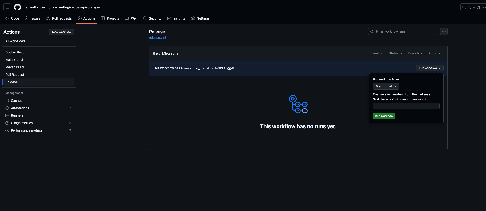

# GitHub Action CI/CD

## Workflows

### Main

This workflow runs automatically whenever a push is made to the `main` branch. It builds the maven artifact, runs all validations, and then builds and pushes the docker image.

### PR

This workflow runs automatically when a PR is opened, and then re-runs every time a push is made to that PR. It builds the maven artifact and runs all validations.

### Release

This workflow is manually triggered from the Actions screen in GitHub. It builds the maven artifact, runs all validations, and then builds and pushes the docker image. It also performs a series of important release-related tasks.

To manually trigger it, a semver-compliant version number (ie, `1.0.0`) must be supplied via an input. Any semver-compliant version number can be used. See the screenshot below for details.

The pipeline will set that version number as the project version, abd the maven artifact and docker image tag will use that version. After the image is published, the repository will have a git tag applied with that version number (ie, `v1.0.0`) and the pom.xml will automatically be bumped to the next highest patch version snapshot (ie, `1.0.1-SNAPSHOT`).

It is strongly recommended that all releases are done using this workflow to guarantee consistency.